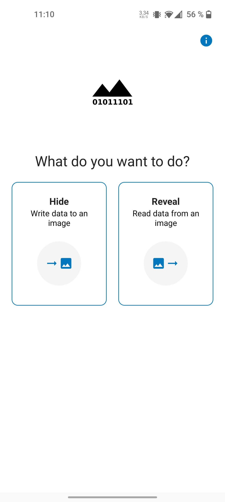
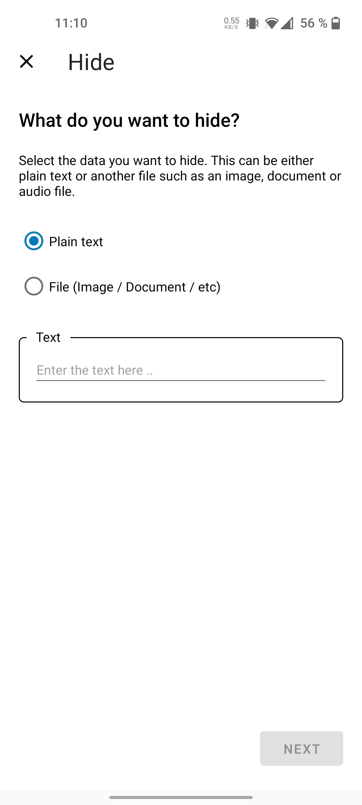
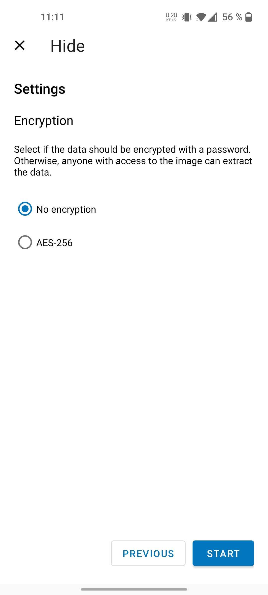
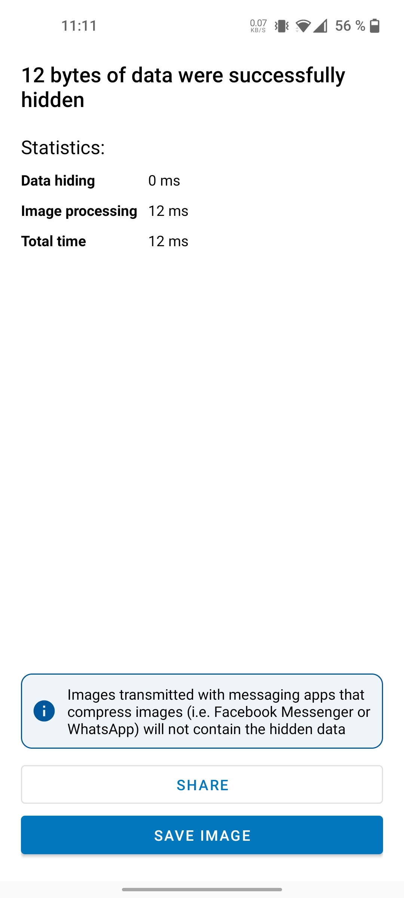
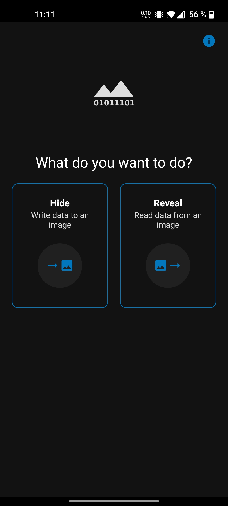
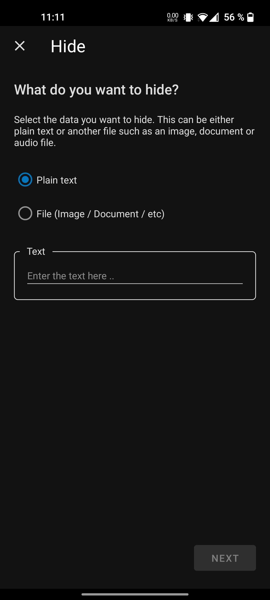
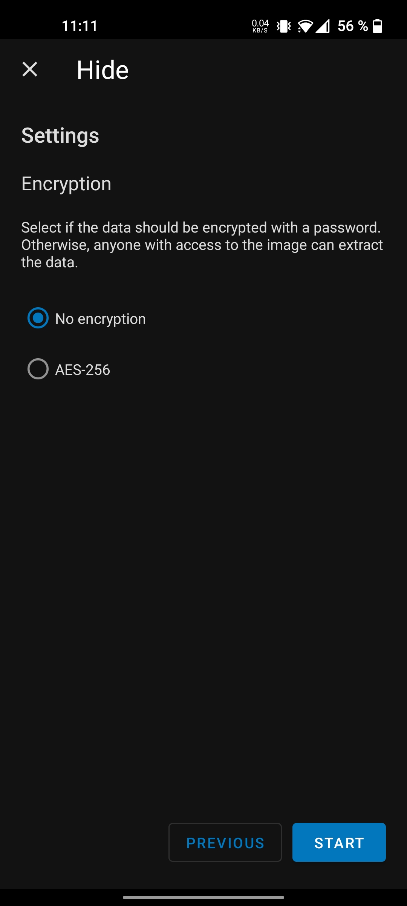
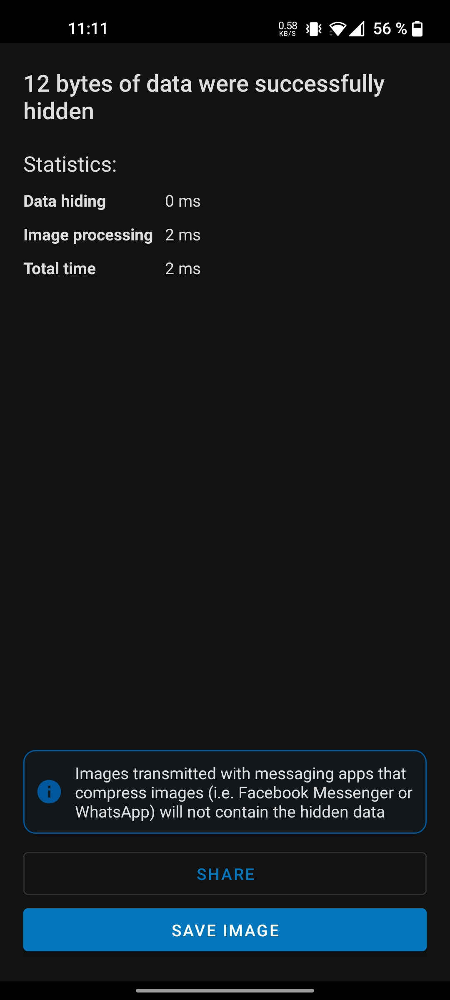
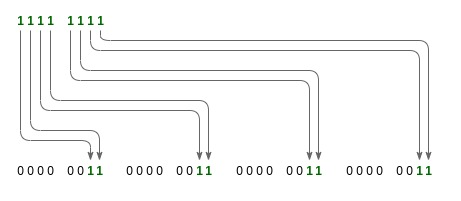

# Steganofy

A simple, fast and open source image steganography app for Android.

 

 

## Features

* Hide data into images
* Reveal data from of images
* Plain text and files support
* AES-256 encryption (optional)
* Light and dark mode

<kbd></kbd>&nbsp;
<kbd></kbd>&nbsp;
<kbd></kbd>&nbsp;
<kbd></kbd>

<kbd></kbd>&nbsp;
<kbd></kbd>&nbsp;
<kbd></kbd>&nbsp;
<kbd></kbd>

 

## Byte Layout

The data to be hidden is written per bit in the pixels of the image. The
two least significant bits of an image byte are replaced with the bits of
the data to be hidden. This way the image is not noticeably changed. To
hide one byte of data, 4 bytes of image data is required:

 

## Data format

The hidden data has the following format:

<pre><code>&lt;Version&gt;&lt;Type&gt;&lt;Encryption algorithm&gt;&lt;Payload length&gt;&lt;Payload&gt;</code></pre>

| Field                | Field length                | Description                                                        |
|:---------------------|:----------------------------|:-------------------------------------------------------------------|
| Version              | <code>1 Byte</code>         | The file format version identifier                                 |
| Type                 | <code>4 Bits</code>         | Type of the payload                                                |
| Encryption algorithm | <code>4 Bits</code>         | Identifier of the encryption algorithm used for payload encryption |
| Payload length       | <code>4 Bytes</code>        | Length of the payload in bytes                                     |
| Payload              | <code><i>n</i> Bytes</code> | Payload depending on type                                          |

### Data Types

| Type           | Description |
|:---------------|:------------|
| <code>1</code> | Plaintext   |
| <code>2</code> | File        |

### Encryption algorithms

| Identifier     | Description   |
|:---------------|:--------------|
| <code>0</code> | No encryption |
| <code>1</code> | AES-256       |

#### AES-256

Payload encryption using `AES/GCM/NoPadding` with
`PBKDF2WithHmacSHA256`. A random salt and IV is generated upon encryption and added as prefix to the
ciphertext. Using this type of payload encryption will increase the size of the payload:

<pre><code>&lt;IV&gt;&lt;Salt&gt;&lt;Ciphertext&gt;</code></pre>

| Field       | Field length          | Description                            |
|:------------|:----------------------|:---------------------------------------|
| IV          | <code>12 Bytes</code> | The initialization vector used for GCM |
| Salt        | <code>16 Bytes</code> | Salt used for PBKDF2                   |
| Cipher text | <code>n Bytes</code>  | Encrypted ciphertext                   |

### Payload

#### Plaintext

The bytes of the plaintext are used as payload.

#### File

File payloads have the following format:

<pre><code>&lt;File mime type length&gt;&lt;File mime type&gt;&lt;File content&gt;</code></pre>

| Field                 | Field length                                        | Description                            |
|:----------------------|:----------------------------------------------------|:---------------------------------------|
| File mime type length | <code>4 Bytes</code>                                | Length of the file mimie type in bytes |
| File mime type        | <code><i>n</i> Bytes</code>                         | File mime type (i.e. "image/jpeg")     |
| File content          | <code>File extension length - payload length</code> | Remaining bytes of payload             |

 

## Contact

If you want to get in contact, contribute to the project or have any questions, feel free to contact me at:

	mstaudt7@gmail.com
-Markus Staudt

 

## License

	Apache License
	Version 2.0, January 2004
	http://www.apache.org/licenses/

